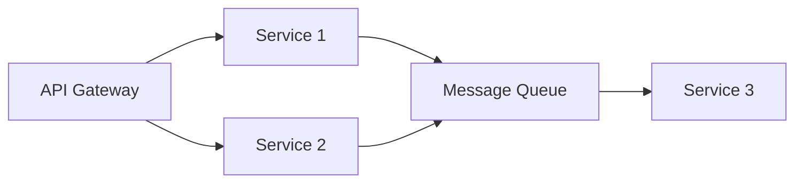

# Microservice Architecture with Tokio and Axum

A scalable microservices architecture implementation using Rust's Tokio runtime and Axum framework, featuring service discovery, load balancing, and asynchronous communication.


## 🚀 Features

- **Microservice Architecture**
  - Independent, loosely coupled services
  - Scalable and maintainable component design
  - Service isolation and resilience

- **Modern Technology Stack**
  - Tokio async runtime for high-performance concurrency
  - Axum web framework for robust HTTP services
  - HTTP/2 support for improved performance
  - Message queue integration (RabbitMQ/Kafka)

- **Advanced Capabilities**
  - Dynamic service discovery
  - Intelligent load balancing
  - Distributed tracing
  - Real-time communication (WebSocket/SSE)

## 🏗️ Architecture Overview



## 🛠️ Prerequisites

- Rust (stable) 1.75+
- Docker and Docker Compose
- Message broker (RabbitMQ/Kafka)
- Service discovery system (Consul/Eureka)

## 🚦 Getting Started

1. Clone the repository:
```bash
git clone https://github.com/your-username/microservice-tokio-axum.git
cd microservice-tokio-axum
```

2. Set up the environment:
```bash
cp .env.example .env
# Configure your environment variables
```

3. Build the project:
```bash
cargo build --release
```

4. Start the services:
```bash
# Start supporting infrastructure
docker-compose up -d

# Start individual services
cargo run --release --bin service1
cargo run --release --bin service2
cargo run --release --bin service3
```

## 🔄 Service Communication

### REST APIs

```bash
# Service 1 API example
curl http://localhost:3001/api/v1/resource

# Service 2 API example
curl http://localhost:3002/api/v1/resource
```

### Message Queue Communication

Services communicate asynchronously through message queues:

```rust
// Publishing example
async fn publish_event(event: Event) {
    // Message queue publishing logic
}

// Consuming example
async fn consume_events() {
    // Message queue consuming logic
}
```

## 🔍 Monitoring and Observability

### Health Checks

Each service exposes a health check endpoint:
```bash
curl http://localhost:300X/health
```

### Metrics

Prometheus metrics are available at:
```bash
curl http://localhost:300X/metrics
```

## 🧪 Testing

Run the test suite:
```bash
# Unit tests
cargo test

# Integration tests
cargo test --test '*'

# End-to-end tests
cargo test --test e2e
```

## 📦 Deployment

### Docker Deployment

Build and run services using Docker:
```bash
# Build images
docker-compose build

# Run services
docker-compose up -d
```

### Kubernetes Deployment

Deploy to Kubernetes:
```bash
kubectl apply -f k8s/
```

## 🔮 Future Enhancements

- [ ] gRPC implementation for inter-service communication
- [ ] Enhanced distributed tracing with OpenTelemetry
- [ ] Circuit breaker implementation
- [ ] Service mesh integration
- [ ] Advanced monitoring dashboards

## 📚 Documentation

- [API Documentation](docs/api.md)
- [Architecture Details](docs/architecture.md)
- [Deployment Guide](docs/deployment.md)
- [Development Guide](docs/development.md)

## 🤝 Contributing

1. Fork the repository
2. Create your feature branch (`git checkout -b feature/amazing-feature`)
3. Commit your changes (`git commit -m 'Add amazing feature'`)
4. Push to the branch (`git push origin feature/amazing-feature`)
5. Open a Pull Request

## 📄 License

This project is licensed under the MIT License - see the [LICENSE](LICENSE) file for details.

## 👥 Maintainers

- Your Name - [@your_github](https://github.com/your_github)

## 🙏 Acknowledgments

- Tokio team for the amazing async runtime
- Axum developers for the excellent web framework
- The Rust community for their continuous support

---
Built with ❤️ using Rust, Tokio, and Axum
